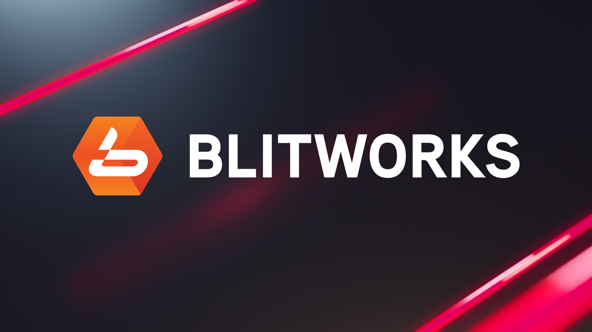
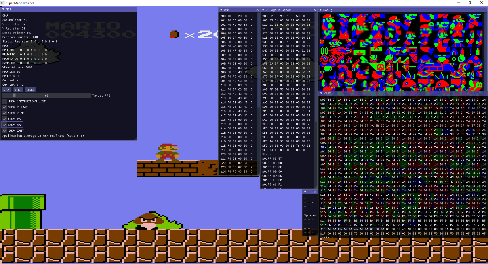
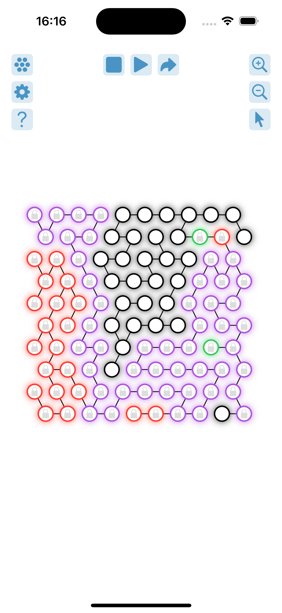
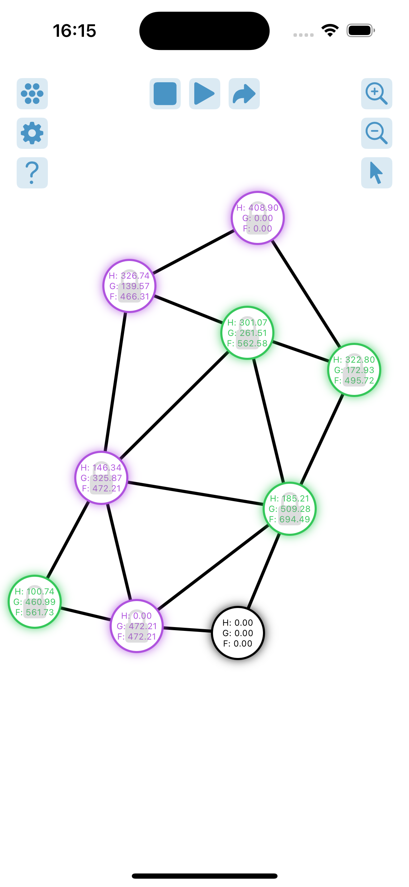
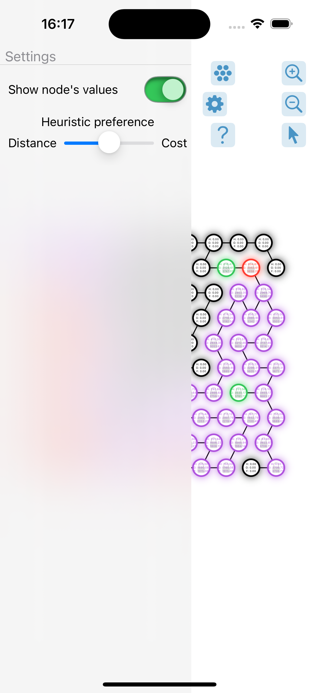

# A little bit about me

Nice to meet you! Even though I'm interested in almost everything, work-wise my interests include Porting, Rendering, Emulation and Optimization. 
My language of preference is C++, althought I've worked with C, C#, ASM, Python, HTML, CSS, PHP, MySQL, and made a few IOS apps using Swift and Firebase. Also, with gpahical APIs such as OpenGL and DX12. 

* * *

# Work experience

<h3>BlitWorks Games (July 2021 - June 2023) </h3>

I was responsible for porting small indie games to game consoles (PS4/PS5/XBoxOne/XBoxSeries/Switch).
Also rewriting already existing parts of the main core framework, more about it is described below.

Projects that I've worked on:

- **Slipstream** (PS4/PS5/XBoxOne/XBoxSeries/Switch) and **Fight'N Rage** (PS5/XBoxSeries)
  - Implementing achievements system (PS4/PS5/XBoxOne/XBoxSeries)
  - Implementing activities system (PS5)
  - Fixing shaders and visual bugs (PIX GDK and PS4/PS5 counterpart)
  - Working on UI
  - Ovelall bugfixing and optimization
  - Handling packaging process
- **Unreleased rogue-like game** (PS5/XBS)
  - Porting multiplayer (PlayFab and PS5 counterpart)
  - Ovelall bugfixing and optimization
- **BattleBrothers** (PS4/XboxOne/Switch)
  - Bugfixing and building patches
 
- Porting the core framework from PS4 to PS5 and from XBoxOne to XBoxSeries
  - Save system
  - Controller and user management
  - Haptic Feedback and Rumble features
  - Graphics core (DX12 and PS5 counterpart)
  - Social services (achievements, activities, rich presence)

* * *

# Commercial projects

<h3>PolyDivider</h3>

Worked as C++ developer on PolyDivider (Cinema4D) plugin for Mike Udin.
All the work was done using C++ and Maxon SDK. 
Responsible for keeping this project up to date. Code is on my github
private repository.

[Store link](https://mikeudin.net/product/polydivider/)

* * *

# Home projects

<h3>NES Emulator</h3>
As a home project, and in learning purposes I've developed a NES emulator that is capable of running SMB, Donkey Kong, Spelunker and much more. 
It was written in C++ with some pieces of OpenGL and ImGui. 

[Github](https://github.com/Danchyg1337/NES6502)

  

<h3>A* Algorithm Visualizer</h3>
A simple app to play with nodes on a movable canvas and run A* search algorithm through them.
It was created using Swift + SwiftUI with the main idea of getting used to Swift and overall practicing.

[Github](https://github.com/Danchyg1337/PathfinderA)